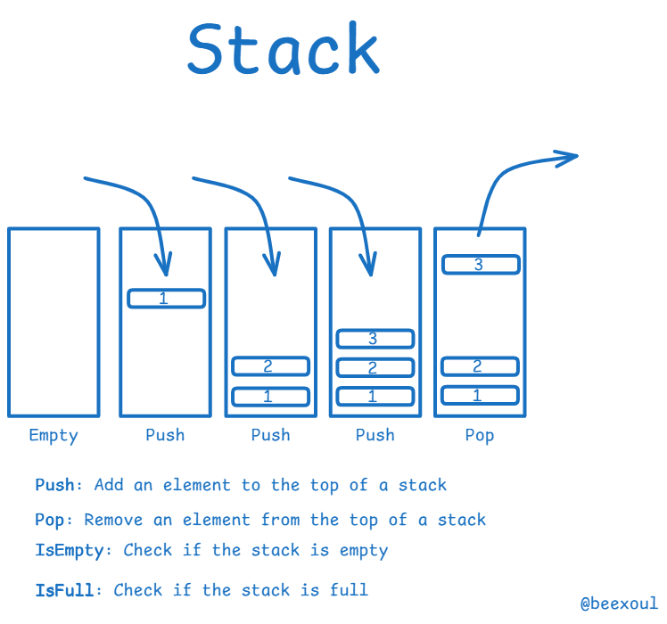

# # Stack Implementation using Linked List



###  Definition: **Stack Using Linked List**

A **Stack** is a linear data structure that follows the **LIFO (Last In, First Out)** principle, where elements are added (pushed) and removed (popped) only from the **top** of the stack.

When a **Linked List** is used to implement a stack, each element (node) contains:

* `data`: the actual value.
* `next`: a pointer to the next node in the stack.

The **top** of the stack is represented by the pointer to the **head** (first node) of the linked list.


###  Characteristics

* **Dynamic Size**: Unlike arrays, the stack size can grow/shrink at runtime.
* **No Overflow (unless memory is full)**.
* Every push inserts a new node at the head.
* Every pop removes the node at the head.


###  Basic Stack Operations using Linked List

| Operation   | Description                                |
| ----------- | ------------------------------------------ |
| `push()`    | Insert an element at the beginning (top)   |
| `pop()`     | Remove the top element                     |
| `peek()`    | Return the top element without removing it |
| `isEmpty()` | Check if the stack is empty                |


###  Visual Representation

```
Top → [10] → [20] → [30] → NULL
```

* If we `push(5)`, it becomes:

```
Top → [5] → [10] → [20] → [30] → NULL
```

* If we `pop()`, it becomes:

```
Top → [10] → [20] → [30] → NULL
```


##  Node Structure

```plaintext
Structure Node:
    data         // Value stored in the node
    next         // Pointer to the next node
```


## Initialization

```

Initialize:
    top ← NULL   // top points to the top of the stack
```
##  PUSH Operation (Insert Element)

```
Algorithm PUSH(value):
    1. Create newNode
    2. Set newNode.data ← value
    3. Set newNode.next ← top
    4. Set top ← newNode
    5. Display "Element pushed"
```
##  POP Operation (Remove Element)

```
Algorithm POP():
    1. IF top = NULL
        Display "Stack Underflow"
        RETURN
    2. temp ← top
    3. top ← top.next
    4. Delete temp
    5. Display "Element popped"
```
##  PEEK Operation (View Top Element)

```
Algorithm PEEK():
    1. IF top = NULL
        Display "Stack is empty"
    2. ELSE
        Display "Top element is: ", top.data
```
##  DISPLAY Stack Elements

```
Algorithm DISPLAY():
    1. IF top = NULL
        Display "Stack is empty"
        RETURN
    2. temp ← top
    3. WHILE temp ≠ NULL
        Display temp.data
        temp ← temp.next
```
##  Summary

* Stack uses dynamic memory (Linked List) to overcome the limitations of static array size.
* Stack operations: `PUSH`, `POP`, `PEEK`, and `DISPLAY` are all **O(1)** time complexity except `DISPLAY`, which is **O(n)**.
* This approach avoids overflow (unless memory is full).

---

#  # Queue Implementation using Linked List


###  **Definition: Queue Using Linked List**

A **Queue** is a linear data structure that follows the **FIFO (First In, First Out)** principle.
Elements are inserted at the **rear** and removed from the **front**.

When implemented using a **Linked List**, each node contains:

* `data`: the value stored in the node.
* `next`: a pointer to the next node.

We use two pointers:

* `front`: points to the first element in the queue.
* `rear`: points to the last element in the queue.


###  **Characteristics**

* **Dynamic Size**: Can grow or shrink as needed.
* No fixed-size limitation as in array-based queues.
* Efficient memory usage.
* No overflow (unless system memory is full).


###  **Basic Queue Operations Using Linked List**

| Operation   | Description                               |
| ----------- | ----------------------------------------- |
| `enqueue()` | Insert an element at the rear             |
| `dequeue()` | Remove the front element                  |
| `peek()`    | Return the front element without removing |
| `isEmpty()` | Check if the queue is empty               |


###  **Visual Representation**

```
Front → [10] → [20] → [30] → NULL ← Rear
```

* After `enqueue(40)`:

```
Front → [10] → [20] → [30] → [40] → NULL ← Rear
```

* After `dequeue()`:

```
Front → [20] → [30] → [40] → NULL ← Rear
```


###  **Node Structure**

```plaintext
Structure Node:
    data         // Value stored in the node
    next         // Pointer to the next node
```


##  Queue Initialization

```
Initialize:
    front ← NULL
    rear  ← NULL
```


##  ENQUEUE Operation (Insert Element)

```
Algorithm ENQUEUE(value):
    1. Create newNode
    2. Set newNode.data ← value
    3. Set newNode.next ← NULL
    4. IF front = NULL
           front ← rear ← newNode
       ELSE
           rear.next ← newNode
           rear ← newNode
    5. Display "Element enqueued"
```


##  DEQUEUE Operation (Remove Element)

```
Algorithm DEQUEUE():
    1. IF front = NULL
           Display "Queue Underflow"
           RETURN
    2. temp ← front
    3. front ← front.next
    4. IF front = NULL
           rear ← NULL
    5. Delete temp
    6. Display "Element dequeued"
```


##  PEEK Operation (View Front Element)

```
Algorithm PEEK():
    1. IF front = NULL
           Display "Queue is empty"
    2. ELSE
           Display "Front element is: ", front.data
```


##  DISPLAY Queue Elements

```
Algorithm DISPLAY():
    1. IF front = NULL
           Display "Queue is empty"
           RETURN
    2. temp ← front
    3. WHILE temp ≠ NULL
           Display temp.data
           temp ← temp.next
```


##  Summary

* Queue with Linked List allows flexible size and avoids memory waste.
* Operations like `ENQUEUE`, `DEQUEUE`, and `PEEK` are **O(1)**.
* `DISPLAY` is **O(n)** where `n` is the number of elements in the queue.
* Handles overflow only when system memory is exhausted.
